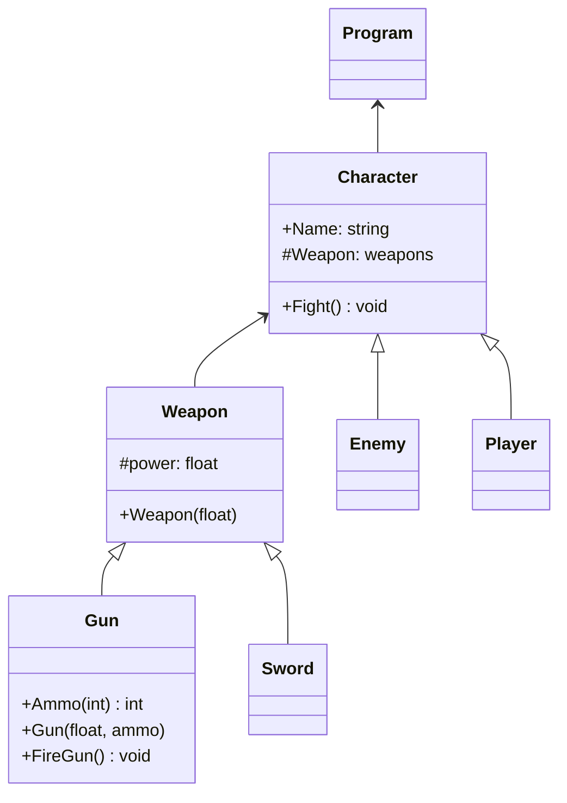

UML Diagram for MiniGame:

```mermaid

classDiagram

Program <-- Character
Character <-- Weapon

Character <|-- Enemy
Character <|-- Player

Weapon <|-- Gun
Weapon <|-- Sword

class Program{
      
}

class Character{
      +Name: string
      #Weapon: weapons
      +Fight() void
}
class Weapon{
      #power: float
      +Weapon(float)
}
class Gun{
      +Ammo(int) int
      +Gun(float, ammo)
      +FireGun() void
}


```
