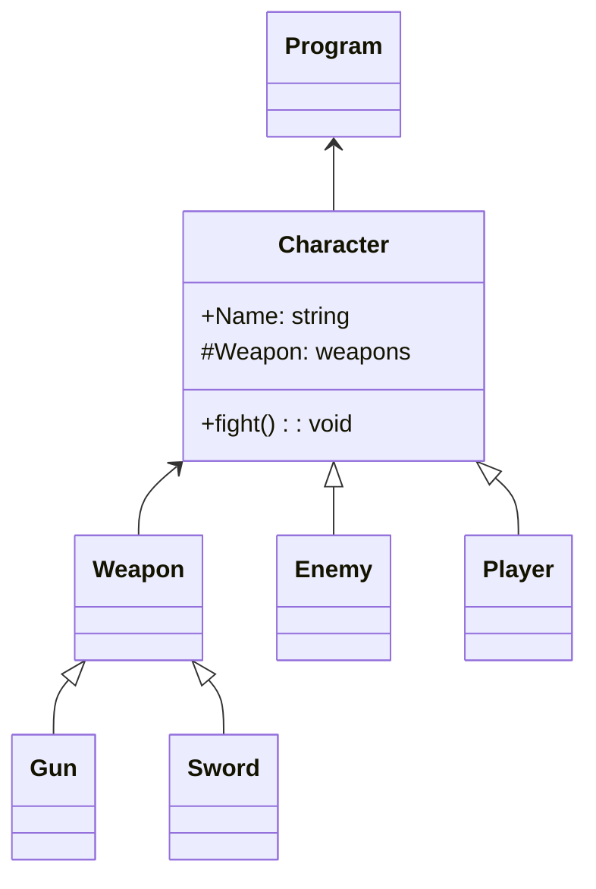

UML Diagram for MiniGame:

```mermaid

classDiagram

Program <-- Character
Character <-- Weapon

Character <|-- Enemy
Character <|-- Player

Weapon <|-- Gun
Weapon <|-- Sword

class Program{
      
}

class Character{
  +Name: string
  #Weapon: weapons
  +fight(): void

}


```
